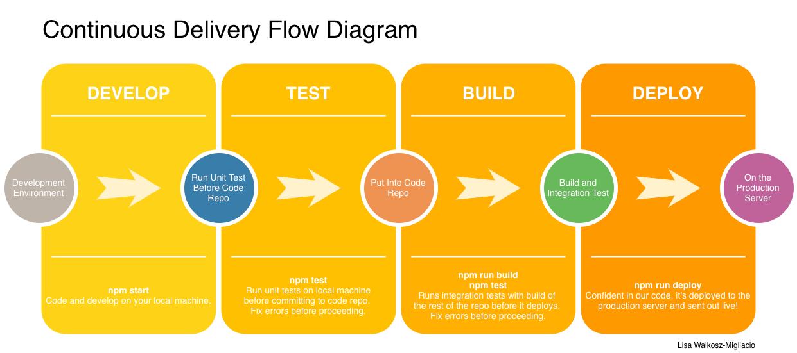

# My Retail Example

## Abstract
Create a sample webpage for a product available on an e-commerce website.

## Technology
This page is written in Javascript using React as the UI layer. It imports a JSON file as information. Test framework is react-testing-library which is a part of Jest, and built and deployed with npm to a GitPages site.

## Author
Lisa Walkosz-Migliacio evilisa@gmail.com

### Working Demo
A working demo is available at: https://missfacetious.github.io/my-retail/

### Continuous Delivery Flow
This project is setup to be run on a development machine, automated tests run, built for production, and then deployed on gitpages.

#### Run on development machine `npm start`
Start the application with `npm start` for a new browser to view the page.
Open [http://localhost:3000](http://localhost:3000) to view it in the browser.

#### Run Automated Tests `npm test`
Included is a test suite of unit tests for the app and components. Test the code with `npm test`. After the tests are all passing, you can build for production.

#### Build for Production `npm run build`
Create a build `npm run build` from the code in the master branch of the repository for the website that will be deployed. When in a real production environment, tests would run between build and deploy stages to make sure integrating the new code doesn't produce problems.

#### Deploy on GitPages `npm run deploy`
Deploy the build of static files on a remote server using `npm run deploy`. It will sent the build files to the gh-pages branch.
https://missfacetious.github.io/my-retail/ will then display the served files.
